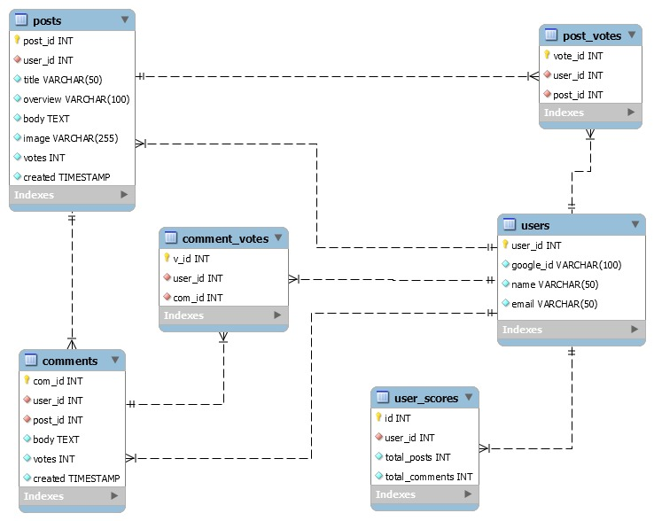

# Open Forum - iOS Application

An iOS application to browse and upvote posts on the Open Forum Platform

## Requirements

### Must have:
* User authentication via Google/Facebook login.
* User level information like Full Name, DOB, Demographic details should becaptured.
* Users can create posts which can have images attached to it along with adescription and a title
* Users may comment on posts or comments.
* An upvote system for both posts and comments.
* A scoring system by which each user is assigned a score based on posts andcomments.
* A system to award users with Badges, such as: Level 1(Contributor), Level 2(Regular Contributor), Level 3(Great Contributor), Level 4 (Ace Contributor).
* A leaderboard which shows trending posts and the top users and posts.

### Good to have:
* A moderator view through which posts and comments can be hidden or deleted.
* A mobile app which allows users to browse posts and upvote them.

## Project Plan

Project plan can be found [here](https://docs.google.com/spreadsheets/d/1SKJNLOZGpvVnqldEJKK9pxMmJqVg8l0btvd9S8mqVsA/edit?usp=sharing)

## ER Diagram

## API Documentation

The API Documentation can be found [here](https://app.swaggerhub.com/apis-docs/Suhas-C-V/OPEN_FORUM_WEB_API/1.0.0#/)

## Tools and Tech

1. NodeJS, Express
2. React.JS
3. Swift
4. MySQL
5. Heroku

## Web App

The Open Forum platform also has a [Web application](https://open-forum-project.herokuapp.com/), which allows users to create, browse, upvote, and comment on posts, and also provides a leaderboard and badges for user's based on their activity.

## Other Repos

* The Backend repo can be found [here](https://github.com/Suhas-C-V/Open-Forum-WebApp)
* The Frontend repo can be found [here](https://github.com/Akhila-Bhupathi/open-forum-project)
